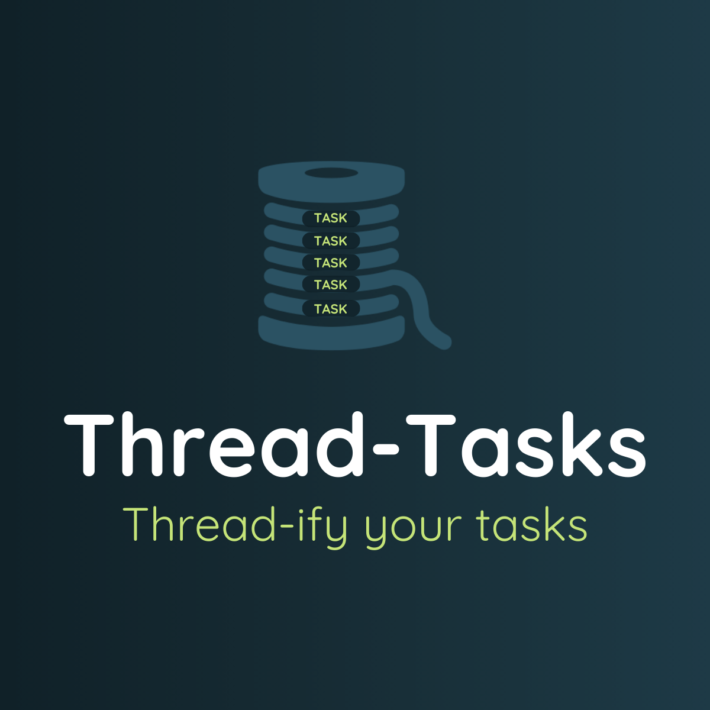

<p align="center">

</p>
<p align="center">
<b>Thread-ify Tasks</b>: Offload your CPU-intensive tasks to separate threads.
</p>

# Installation
```bash
npm install thread-tasks
```
# Basic Usage
```typescript
const task = {
  fn: () => console.log('Hello World!')
};
threadTasks([task]);
```


# Functions
- `threadTasks`
- `threadTasksAdvanced`

# `threadTasks`
`threadTasks` takes in an array of task objects and returns an array of workers.

**Task Object:** Each task object should have the following properties:
- `fn`: the function (task) to be executed. Can be a normal function or an async function.
- `args`: an optional object containing arguments to be passed to the function.
- `onSuccess`: an optional callback function to be executed when the function completes successfully.
- `onError`: an optional callback function to be executed when the function throws an error.

## Examples

### Basic Usage
```typescript
const task = {
  fn: () => console.log('Hello World!')
};
threadTasks([task]);
```

### Passing Arguments and Callbacks
```typescript
const tasks = [
  {
    fn: data => data.a + data.b,
    args: { a: 1, b: 2 },
    onSuccess: msg => console.log(`Sum = ${msg}`),
    onError: err => console.log(err.message)
  }
  // ... other tasks to be executed in parallel ...
];
threadTasks(tasks);
```
### Using API Requests
```typescript
const tasks = [
  {
    fn: async data => {
      const res = await fetch(data.url);
      const json = await res.json();
      return json;
    },
    args: { url: 'https://jsonplaceholder.typicode.com/posts/1' },
    onSuccess: json => console.log(JSON.stringify(json))
  }
];
threadTasks(tasks);
```

### Using External Packages
```typescript
const tasks = [
  {
    fn: async data => {
      const axios = require('axios');
      const res = await axios.get(data.url);
      return res.data;
    },
    args: { url: 'https://jsonplaceholder.typicode.com/posts/1' },
    onSuccess: data => console.log(JSON.stringify(data))
  }
];
threadTasks(tasks);
```

# `threadTasksAdvanced`
`threadTasksAdvanced` takes in the following properties:

- `tasks`: An array of task objects
- `getMaxThreads`: An optional callback function that returns the maximum number of parallel tasks allowed to run simultaneously.
-  `afterAll`: An optional callback function that is executed after all of the tasks have been completed.

and returns a promise that resolves once all the tasks have been processed.

## Examples

### Execute 4 Tasks in Parallel
Assume `listOfTasks` is a large array of tasks.
```typescript
const allTasksExecuted = await threadTasksAdvanced({
  tasks: listOfTasks,
  getMaxThreads: () => 4,
  afterAll: () => console.log('All tasks done.')
});
```
A maximum of 4 tasks will executing in parallel. As soon as one task finishes, another one will take its place. Until all tasks have finished execution.

### Limit Parallel Tasks Using `env.json` Configuration
```typescript
const allTasksExecuted = await threadTasksAdvanced({
  tasks: listOfTasks,
  getMaxThreads: () => {
    const { readFileSync } = require('fs');
    const featureFlags = JSON.parse(readFileSync('./env.json', 'utf8'));

    if (featureFlags?.USE_ALL_CORES === true) {
      const { cpus } = require('os');
      const cpuCount = cpus().length;
      return Number(cpuCount);
    }
    
    if (featureFlags?.MAX_THREADS) {
      return Number(featureFlags.MAX_THREADS);
    }
    
    return 2;
  }
});
```
You can change values like `MAX_THREADS` in `env.json` while tasks are running. The updated value will take effect immediately after the file is saved, allowing you to adjust the maximum thread count (the number of tasks running simultaneously) on the fly.

# Use Cases

- Data processing
- Image or Video processing
- Analytics

## License
MIT License
